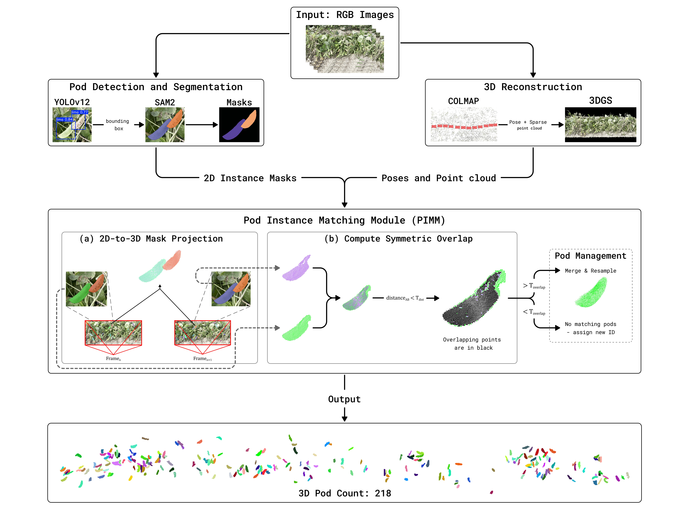

# PRIM3: Pod Reconstruction and Instance Matching in 3D for Lima Bean Pod Counting and Yield Assessment

<p align="center">
    <a href='https://papers.ssrn.com/sol3/papers.cfm?abstract_id=7118982'>
      
    </a>
</p>

> This repository is the official implemetation of the paper **PRIM3**.

<div align=center>

</div>


## Project Roadmap

We will update this repository with data and code for reproducibility of our work:

- [x] **PIMM Implementation Code** (Available)
- [ ] **Dataset** (Coming Soon)
- [ ] **Complete PRIM3 Pipeline** (Coming Soon)
- [ ] **Evaluation Results** (Coming Soon)

<details>
  <summary><h2>1. PIMM — Pod Instance Matching Module</h2></summary>


PIMM is used for tracking and merging 3D object instances
across a sequence of frames, using symmetric point-cloud overlap matching. It requires 2D-3D segmented/projected objects for each frame.


### PIMM consists of three stages:

1. **`preprocessing`**: Statistical outlier removal and DBSCAN-based clustering (to remove any noise), and an optional voxel downsampling.
2. **`Symmetric Overlap (matching)`**: Pairwise similarity between point clouds, resolved via the Hungarian algorithm for globally optimal one-to-one assignment between two sets of pod point clouds. Two interchangeable metrics, either usable as the main frame-to-frame matching strategy: symmetric overlap score (`match_by_overlap`, two parameters -- distance and score) and Chamfer-L2 distance (`match_by_chamfer`, one parameter -- chamfer ).
3. **`tracker`** (`PodTracker`) and **`management`**: The frame-by-frame tracking loop matches each frame's pod point clouds against existing tracks using matching method (`matching_method="overlap"` or `"chamfer"`) - based on provided matching crieteria it merges matches, starts new tracks for any new and unmatched instances, and carries forward existing tracks that went unmatched this frame. `management` handles keeping a merged track's point count bounded via farthest point sampling (FPS) as it accumulates incoming object point clouds across many frames.

## Install

```bash
pip install -e .
```

Requires Python >= 3.9, `numpy`, `open3d`, `scipy`.

## Quick usage

```python
from pimm import PointCloudPreprocessor, PodTracker

# frames: list of frames, each frame (item) is a list of projected pod pointclouds (o3d.geometry.PointCloud), Coordinate System: Camera Frame .

preprocessor = PointCloudPreprocessor(dbscan_eps=0.02, dbscan_min_points=25)
cleaned_frames = [[preprocessor.clean(pcd) for pcd in frame] for frame in frames]

tracker = PodTracker(
    batch_size=-1,                  # -1 = one batch, process the whole sequence at once
    matching_method="overlap",      # or "chamfer"
    overlap_dist_thresh=0.01,
    overlap_score_thresh=0.3,
    max_points_per_track=5500,      # FPS cap on a track's accumulated point count
)

final_instances = tracker.run(cleaned_frames)  # list of final tracked pod point clouds (o3d.geometry.PointCloud), Coordinate System: World Frame.

# Optional summaries
from pimm import save_labeled_pointcloud, save_centroid_pointcloud

save_labeled_pointcloud(final_instances, "tracked_instances.ply")  # one file, per-point instance ID + color - returns an overall tensor point cloud
save_centroid_pointcloud(final_instances, "centroids.ply")         # one point per instance, at its centroid
```

See `examples/basic_usage.py` for a complete, runnable, synthetic example.

</details>

<details>
  <summary><h2>2. Download Dataset</h2></summary>

To reproduce our counting results you can download the trained model weights, 3DGS extracted point clouds and depth maps for every sample. Download can be found here: TBD.

</details>


## Acknowledgements

Our work builds upon **Gaussian Opacity Fields**. We highly appreciate the authors for their excellent work:


[SIGGRAPH ASIA 2024] [**Gaussian Opacity Fields: Efficient Adaptive Surface Reconstruction in Unbounded Scenes**](https://github.com/autonomousvision/gaussian-opacity-fields)


## License

See the [LICENSE](LICENSE) file for details.


## Citation

If you use PIMM, please cite the PRIM3 paper:

```bibtex
@article{Reddy_PRIM3,
  title   = {PRIM3: Pod Reconstruction and Instance Matching in 3D for Lima Bean Pod Counting and Yield Assessment},
  author  = {Mulaka, Ashish Reddy and Ernest, Emmalea G and Hampton, Ekaterina D and Huang, Guoquan and Bao, Yin},
  year    = {2026}
}
```